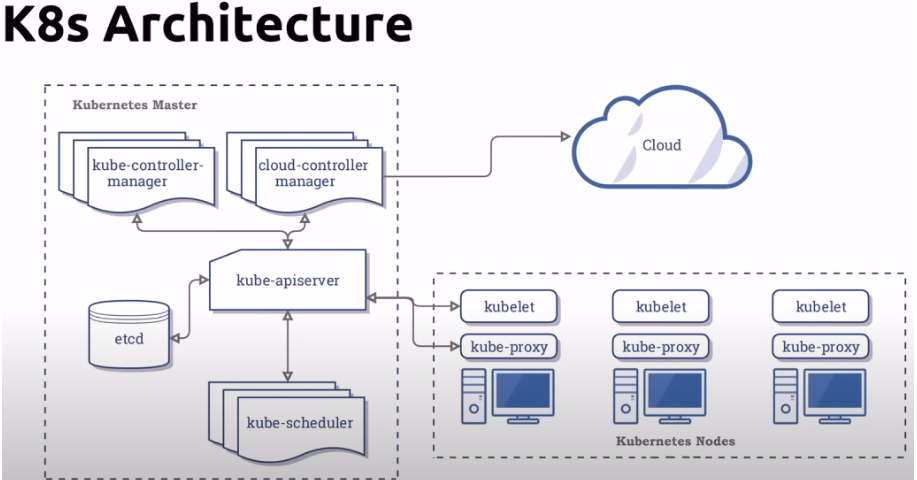
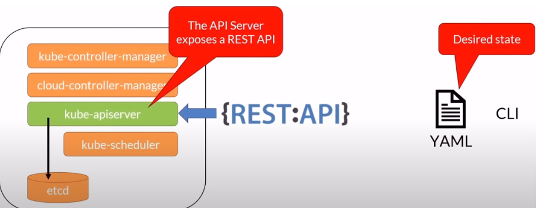
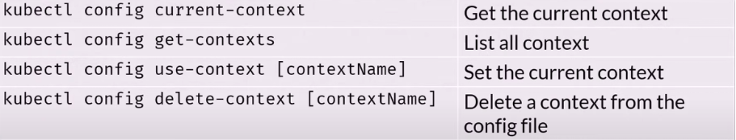
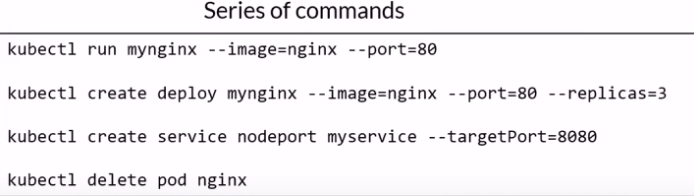
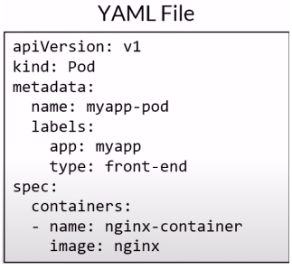
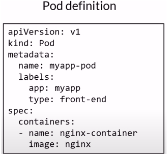
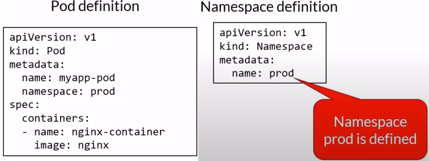
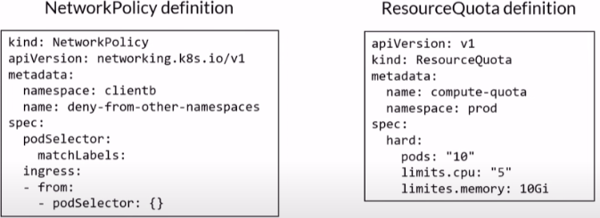
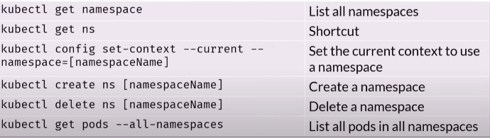

# Kubernetes - k8s 

- Is the leading container orchestration tool
- Designed as a loosely coupled collection of components centered around deploying, maintaining and scaling workloads
- Vendor-neutral
	- Runs on all cloud providers
- Backed by huge community

**What do K8s do?**
- Service discovery and load balancing
- Storage Orchestration
	- Local or Cloud based
- Automated rollouts and rollbacks
- Self-healing
- Secret and configuration management
- Use the same API across on-prem and cloud
**What K8s cannot do**
- Does not deploy source code
- Does not build your application
- Does not provide application-level services
	- Message buses ,databases, caches etc

**K8s Architecture Image**

**Composed of**
- Master Node also known as control plane
	- Runs Kubernetes services and controllers
- Worker Nodes
	- Runs the containers that you deploy 

**Example**
- Container runs in a pod
	- Pod runs in a node
		- All nodes form a cluster

## Running Kubernetes Locally

**Local K8s**
- Requires Virtualisation
	- Docker Desktop
	- MicoK8s
	- Minikube
- Runs over Docker Desktop
	- Kind (Kubernetes in Docker)
- Limited to 1 Node
	- Docker Desktop
- Multiple Nodes
	- MicroK8s
	- Minikube
	- Kind
- Windows
	- Docker Desktop is currently only way to run both Linux and windows containers
		- Runs on Hyper-V or WSL 2
	- If Hyper-V is enabled, you can't run another hypervisor at the same time
	- You can install Minikube on Hyper-V or Virtual Box

**Kubernetes Local** - Using CMD or PowerShell

-  This command lets you check if Kubernetes is running: `kubectl cluster-info dump

**Kubernetes CLI**
- K8s API:

- **kubectl** - The main command for K8s
	- Communicates with the api server
	- Configuration stored locally under:
		- ${HOME}/.kube/config
		- C:\Users\{USER}\.kube\config
- **K8s Context**
	- A context is a group of access parameters to a K8s cluster
	- Containers a Kubernetes cluster, a user and a namespace
	- The current context is the cluster that is currently the default for kubectl
		- All kubectl commands run against that cluster

- Kube tools
	- kubectl - Useful for fast context usage, install using: `choco install kubectx-ps` if you have 'Choco' installed
- Rename a context: `kubectl config rename-context [oldname] [newname]`

**Declarative vs Imperative**
- Imperative:
	- Using kubectl commands, issue a series of commands to create resources
	- Great for learning, testing and troubleshooting
	- It's like code
- Declarative:
	- Using kubectl and YAML manifests defining the resources you need
	- Reproducible and repeatable
	- can be saved in source control
	- Its like data that can be parsed and modified

**Imperative**:

**Declarative**:

## **YAML**
 - Root level required properties
	 - apiVersion
		 - Api version of the object
	- kind
		- type of object
	- metadata.name
		- unique name for the object
	- metadata.namespace
		- scoped environment name (will default to current)
	- spec
		- object specifications or desired state
- Create an object using YAML
	  kubectl create -f [YAML file]
  

**Note:**
- We do NOT need to type all the YAML manually, we can get the syntax from kubernetes.io/docs and search and copy
- We can create using manifests (templates) in VS Code, in new YAML file, hitting ctrl+space and select the template you need
- Kubernetes CLI to generate manifests: `--dry-run=cleient -o yaml`

## Deploying an Imperative and Declarative container

- For **Imperative**:
	- `kubectl create deployment mynginx1 --image=nginx` 
	- we can check if its created using: `kubectl get  deploy`
- For **Declarative**
	- `kubectl create -f deploy-example.yaml` - Must have the 'deploy-example.yaml' file exist and must contain some data
- **Useful commands**
	- `kubectl get  deploy` - Listing all the running deployments
	- `kubectl delete deploy example-deployment-name ` - after running the first command, you can delete using the 'name' 

## Namespaces
- Allow to group resources
	- Example: Dev,Test,Prod
- K8s create a default workspace
- Objects in one namespace can access objects in a different one
	- Example: objectname.**prod**.scv.cluster.local
- Deleting a namespace will delete all its child objects

- Define a namespace
- Specify the namespace when defining objects

- You can limit resources using the resource quota object

**Kubectl - Namespace sheet commands**

